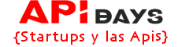

# Startups y las Apis # 18

# [](https://github.com/apiaddicts/startupsylasapisIII)

### About

Project is built on top of [Jekyll](http://jekyllrb.com/)

### Live demo 
[https://startupsylasapis/2018/](https://startupsylasapis.es/2018)

### Contributions welcome
1. Clone the repo
2. Create a branch from `master`
3. Update / Fix 
4. Create a pull request and assign it to me, @MarAntonio Marco Antonio Sanz)

## Local development

Check if you have [all requirements for local environment](http://jekyllrb.com/docs/installation/).
To install all development dependencies install [Bundler](http://bundler.io/).
```bash
gem install bundler
```
and run next command from root folder:

```bash
bundle install
```  

To start Jekyll run:
```bash
jekyll serve -w
```
Site will be available at http://127.0.0.1:4000/startupsylasapis/ or http://localhost:4000/zeppelin/ (on Windows)

**NOTE:** in this mode all changes to html and data files will be automatically regenerated, but after changing ```_config.yml``` you have to restart server.

### Documentation
Quick-start guide is not enough? Checkout [full documentation](https://github.com/gdg-x/zeppelin/wiki).

### Used libraries
* [Bootstrap](https://github.com/twbs/bootstrap)
* [Animate.css](https://github.com/daneden/animate.css)
* [Waves](https://github.com/publicis-indonesia/Waves)
* [jquery.appear](https://github.com/bas2k/jquery.appear)
* [jQuery countTo Plugin](https://github.com/mhuggins/jquery-countTo)
* [Typed.js](https://github.com/mattboldt/typed.js)
* [Sticky-kit](https://github.com/leafo/sticky-kit)


### Contributors

See [list of contributors](https://github.com/apiaddicts/startupsylasapisIII/graphs/contributors?from=2017-08-10)

Maintainers: [@MarAntonio82](https://github.com/apiaddicts)


### License
Project is published under the [MIT license](https://github.com/gdg-x/zeppelin/blob/master/LICENSE.txt). 
Feel free to clone and modify repo as you want, but don't forget to add reference to authors :)
